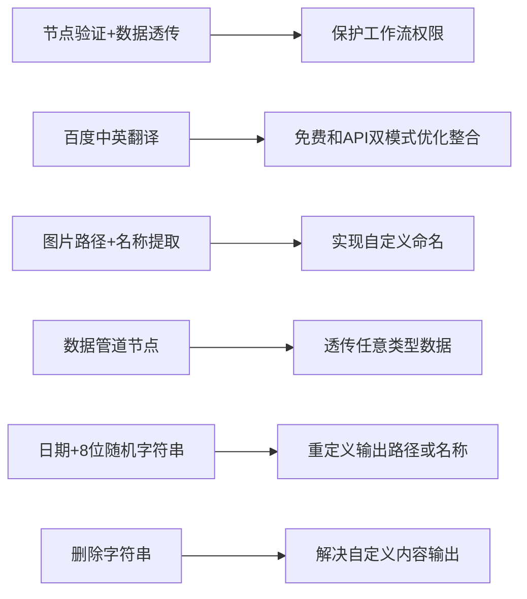

# 子禾AI节点库：高效工作流定制组件

## 概述
本库提供了一系列实用节点，用于构建企业级AI工作流，支持文本处理、文件操作、数据验证等功能。所有节点均由子禾AI开发维护，可提供**私有化定制**与**性能优化**服务。


## 节点功能说明
### 🔐 1. 验证节点 (ZiheAuthNode)

* **功能**: 验证输入口令，保护工作流权限
* **输入**:
  * `cardCode`: 验证口令(例如：123)
  * `passthrough`: 透传数据(可选)
* **输出**:
  * `output`: 验证成功时返回透传数据，失败返回None
  * `status`: 验证状态(✅验证成功✅/❌验证失败❌)
* 示例代码:
```python
# 正确口令返回透传数据
output, status = ZiheAuthNode().func("ziheAI.com", "透传数据")
```
### 🌐 2. 百度翻译节点 (BaiduTranslate_API)
* **功能**: 实现中英互译，支持免费/API 双通道
* **输入**:
  * `text`: 待翻译文本
  * `Channel`: 翻译通道(Free免费版/API官方API)
  * `Translate_To`: 目标语言(en/zh)
* **输出**:
  * `STRING`: 翻译结果
* **配置准备**:  
&nbsp;&nbsp;1. 在`configs/BaiduApikey.json`中添加百度API密钥  
&nbsp;&nbsp;2. 免费通道无需配置  
* **特点**: 自动检测中文内容，支持长文本翻译
### 📂 3. 文件名提取节点 (ImgNameExt)
* **功能**: 从文件路径提取纯净文件名(不含扩展名)
* **输入**:
  * `file_path`: 文件路径
* **输出**:
  * `img_name`: 无扩展名的文件名
* **示例代码**
 ```python
name = ImgNameExt().func("/images/photo.jpg")  # 返回 "photo"
``` 
### ➿ 4. 数据管道节点 (DataPipeline)
* **功能**: 透传任意类型数据，简化工作流连接
* **输入**:
  * `anything`: 任意类型数据(可选)
* **输出**:
  * `*`: 原样输出的输入数据
* **应用场景**: 工作流中的数据中转站
### 🎲 5. 随机字符串节点 (RandomDateNode)
* **功能**: 生成日期前缀的随机字符串
* **输入**:
  * `input_data`: 透传数据
* **输出**:
  * `passthrough`: 原样输出的输入数据
  * `random_str`: 格式为YYYYMMDD_8位随机字符
* **示例输出**
 ```python
20250530_xY7f9K2a
``` 
### ✂️ 6. 字符串删除节点 (StringDel)
* **功能**: 删除指定子串或正则匹配内容
* **输入**:
  * `string`: 原始字符串
  * `target`: 要删除的内容
  * `use_regex`: 是否使用正则表达式
* **输出**:
  * `STRING`: 删除后的字符串
* **示例代码**
 ```python
# 删除数字部分
result = StringDel().delete_str("Hello123", "123", False)  # 返回 "Hello"

# 使用正则删除所有数字
result = StringDel().delete_str("Text123", "\\d+", True)  # 返回 "Text"
```
_______________________________________________________________________________________  
## 安装
 ```cmd
git clone https://github.com/ziheAI/ComfyUI_ziheAI_Nodes.git
```
* **1.重启**ComfyUI。

* **2.依赖**安装：

  * 首次运行节点时，将自动下载并安装所需的依赖项。
  * 注意：部分依赖可能需要重启ComfyUI后才能生效。如果遇到问题，请尝试重新启动ComfyUI。
* **3.模型**下载：

  * 如果模型文件不存在，将在首次使用时自动下载。
  * 由于模型文件较大，下载可能需要一些时间，请耐心等待。
* **注意**：初次使用时，由于需要下载模型和安装依赖，启动时间可能会较长。后续使用将会更快。
_______________________________________________________________________________________  
## 使用
安装后，您可以在ComfyUI的节点菜单的“ziheAI Nodes”类别中找到相关节点。
_______________________________________________________________________________________  
# 本库所有代码已开源，欢迎学习交流自用！
# 禁止一切未经授权情况下的任何商业行为。
## 商务合作
  * ✉️ 邮箱: ziheAI567@163.com
  * 💬 微信: ziheAI567(请备注来意)
  * 🌐 官网: [[ziheAI.com](https://ziheai.com/)]
## 服务项目
  * 🏢 企业级AI工作流开发
  * 🔒 私有化节点定制
  * ⚡ 系统性能优化
  * 🧩 功能模块扩展  
&nbsp;&nbsp;使用授权口令获取：联系微信 ziheAI567(免费)
